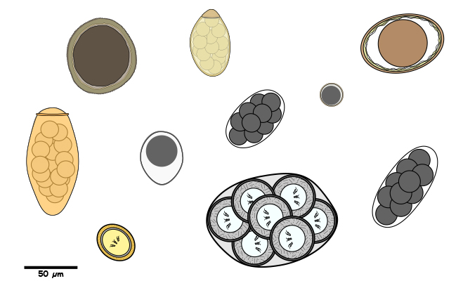

# (PART\*) PREFACE {-}

# Welcome {-}

Welcome to the world of parasites. This webook is prepared as a reference resource to the Vet Parasitology Course and will elaborate on the things discussed in the lectures. I will keep on updating this resource regularly.




## Some disclaimers {-}


``` {block2 type="imp"}
* Pelase use this web book only as refernce material and refrain from sharing it elsewhere. I have sections which are not properly referenced and the some images might not have proper credits, so please check with me if you want to share the images publicly.

* Dont rely fully on this book. There are plenty of resource available to expand your knowledge on veterinary parasitology.
```
